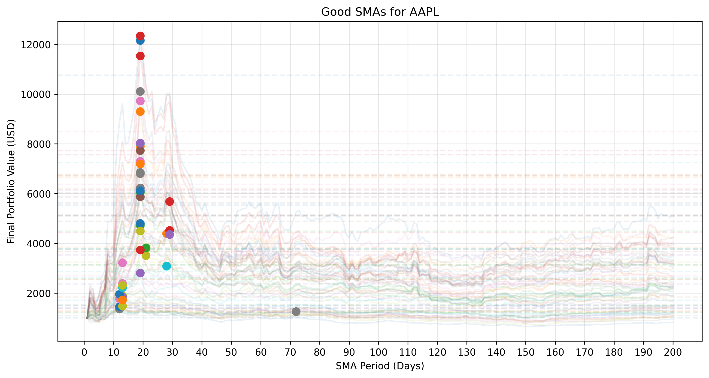
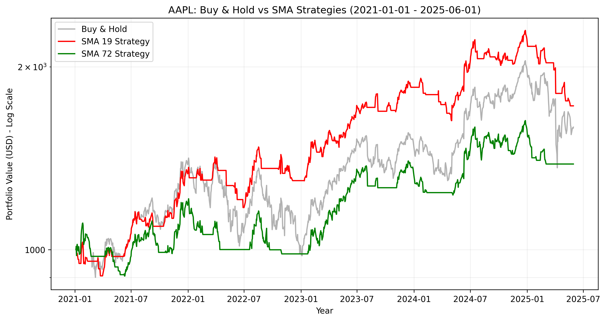

# SMA Strategy Backtester and Optimizer

A professional Python-based tool for simulating and optimizing Simple Moving Average (SMA) trading strategies. This script uses a "training and testing" approach: it runs multiple simulations across random historical windows to find the most robust SMA periods, then validates those findings against a modern testing dataset.

## Features

**Monte Carlo Simulations**: Generates random historical date ranges to ensure SMA consistency across different market conditions.

**SMA Clustering**: Groups high-performing SMAs into "stable zones" rather than relying on a single outlier.

**Visual Analytics**: Automatically generates distribution plots and final equity curves.

**Robust Logging**: Execution history saved to ``app.log`` via picologging.

## Installation
This project uses ``virtualenv`` to manage dependencies. Ensure you have Python 3.8+ and the virtualenv package installed.

### Clone the repository:

```console
$> git clone https://github.com/kumailxp/backtest-sma-optimisation
$> cd backtest-sma-optimisation
```

### Create a virtual environment:
```console
$> mkdir .venv
$> virtualenv .venv
```
### Activate the environment:

```console
Windows: 
C:\> .venv\Scripts\activate

Mac/Linux:
$> source .venv/bin/activate
```
### Install dependencies:

```console
$> pip install -r requirements.txt
```

## Command Line Interface (Help)
Available options can be seen with `python backtest_sma_optimisation.py -h`:
```Plaintext
Usage: backtest_sma_optimisation.py [-h] [-t TICKER [TICKER ...]] 
                                    [-s NUMBER_OF_SIMULATIONS] 
                                    [--start-date START_DATE] 
                                    [--end-date END_DATE]

Description:
  Simulate SMA strategy and backtest the best SMAs. Training dataset is from 
  2014-01-01 to 2021-01-01. Default testing dataset is from 2021-01-01 to 
  2025-06-01, but the user can change this using the flags below.

Options:
  -h, --help            show this help message and exit
  -t, --ticker          ticker symbol (accepts multiple)
  -s, --number-of-simulations
                        number of simulations to run (default: 50)
  --start-date          start date for testing dataset (YYYY-MM-DD)
  --end-date            end date for testing dataset (YYYY-MM-DD)
```

## How It Works
**Data Fetching**: Downloads historical data (starting from 2014) for the specified ticker(s) from Yahoo Finance.

**Random Sampling**: Generates N random date ranges (default 50) to act as "training" datasets.

**SMA Optimization**: For every range, it tests SMA periods (1-200) and compares ROI against "Buy & Hold".

**Clustering**: It identifies the most frequent high-performing SMAs across all random samples.

**Testing**: Validates the "Best SMAs" on the testing period (default: 2021–2025).

## Usage Example

1. Basic usage (Single Ticker)
    ```console
    $> python backtest_sma_optimisation.py --ticker BTC-USD
    ```

2. Process Multiple Tickers
    ```console
    $> python backtest_sma_optimisation.py -t AAPL TSLA ETH-USD
    ```

3. High-Intensity Simulation
    ```console
    $> python backtest_sma_optimisation.py -t BTC-USD -s 100 --start-date 2022-01-01 --end-date 2024-12-31
    ```

4. Read Symbols from File (Default): If no ticker is provided, the script reads from `ticker_list.txt`. This allows reading a large list of symbols
    ``` console
    $> python backtest_sma_optimisation.py
    ```

## How to format `ticker_list.txt`
To use the file-based input, create a file named ``ticker_list.txt`` in the root directory and add symbols like this:

```Plaintext
BTC-USD
ETH-USD
AAPL
TSLA
```

## Generated Plots
After running the script, your results will be saved in the my_plots/ folder. Here is what the output looks like:

1. SMA Optimization Distribution
This plot shows the "clusters" of successful SMA periods found during the simulation phase.


2. Strategy Backtest Results
The final equity curve comparing your optimized SMA strategy against the standard Buy & Hold (HODL) benchmark.



## Copyright & License

This software is provided for educational and research purposes. Trading financial assets involves significant risk. The authors are not responsible for any financial losses incurred through the use of this script.

**MIT License**

Permission is hereby granted, free of charge, to any person obtaining a copy of this software and associated documentation files (the "Software"), to deal in the Software without restriction, including without limitation the rights to use, copy, modify, merge, publish, distribute, sublicense, and/or sell copies of the Software, and to permit persons to whom the Software is furnished to do so, subject to the following conditions:

The above copyright notice and this permission notice shall be included in all copies or substantial portions of the Software.

THE SOFTWARE IS PROVIDED "AS IS", WITHOUT WARRANTY OF ANY KIND.
